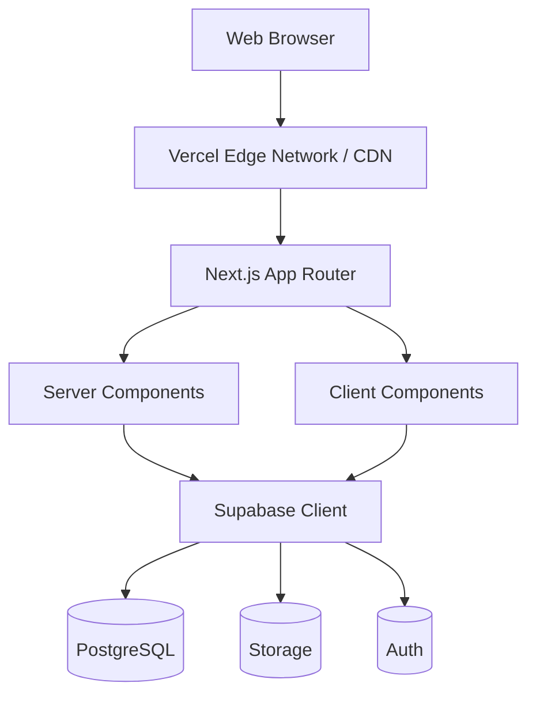
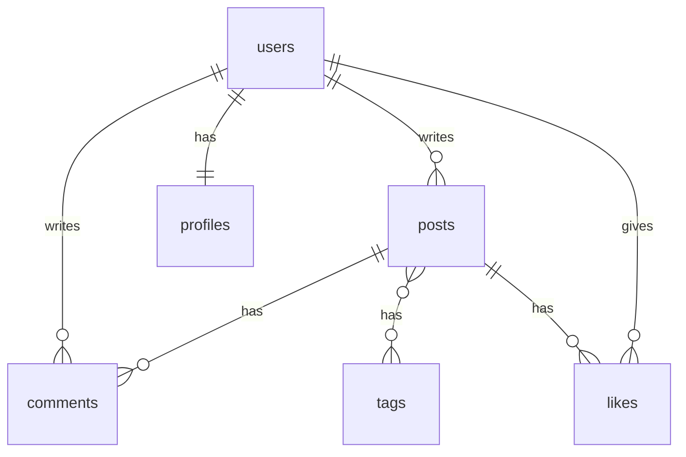
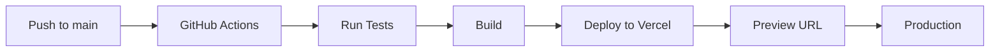

# 📝 技术 SPEC：博客系统（Blog System）

> **版本**：1.0  
> **最后更新**：2026-01-28  
> **状态**：草稿  
> **负责人**：待定  
> **目标**：构建一个支持内容创作、发布、评论与基本管理的现代化博客平台

---

## 1. 项目概述

### 1.1 项目背景
本项目是一个现代化的博客系统，使用Next.js作为前端框架，shadcn/ui作为UI组件库，Supabase作为后端服务和数据库解决方案。该系统将提供完整的博客功能，包括文章发布、用户管理、评论系统等。

### 1.2 核心问题
为内容创作者提供一个简洁、安全、可扩展的自托管博客平台。

### 1.3 目标用户
| 用户类型 | 描述 | 核心需求 |
|---------|------|----------|
| 个人博主 | 独立内容创作者 | 简单易用的写作和发布体验 |
| 技术写作者 | 技术文档和教程作者 | Markdown支持、代码高亮 |
| 小型团队 | 企业或组织内容站点 | 多用户管理、权限控制 |

### 1.4 成功指标
| 指标 | 目标值 | 测量方式 |
|------|--------|----------|
| 页面加载时间 | < 1s (P95) | Lighthouse/Web Vitals |
| 并发用户支持 | 100+ | 负载测试 |
| 首字节时间(TTFB) | < 300ms | 性能监控 |
| SEO评分 | > 90 | Lighthouse SEO审计 |
| 测试覆盖率 | > 80% | Jest Coverage |

## 2. MVP 版本规划

### 2.1 MVP 功能范围（第一期）
| 模块 | 功能 | 说明 |
|------|------|------|
| 用户认证 | 登录/注册/登出 | 支持邮箱和OAuth(GitHub) |
| 文章管理 | 创建/编辑/删除/发布 | 支持Markdown编辑器 |
| 文章展示 | 列表/详情/分页 | SSG静态生成 |
| 标签系统 | 标签管理和筛选 | 基础标签功能 |
| 个人资料 | 基本信息编辑 | 头像、简介等 |

### 2.2 后续迭代（第二期+）
- 评论系统
- 点赞/收藏
- RSS订阅
- 搜索功能
- 数据统计

## 3. 功能需求（User Stories）

| ID | 用户角色 | 需求描述 | 优先级 | 验收标准 |
|----|--------|--------|-------|----------|
| F1 | 博主 | 能创建、编辑、删除草稿和已发布文章 | P0 | 文章CRUD操作正常，支持草稿保存 |
| F2 | 访客 | 能浏览公开文章列表及详情页 | P0 | 列表分页正常，详情页SEO友好 |
| F3 | 访客 | 能对文章发表评论（需审核或开放） | P1 | 评论提交成功，支持审核流程 |
| F4 | 博主 | 能管理评论（批准/删除） | P1 | 后台可查看、审核、删除评论 |
| F5 | 所有用户 | 能通过标签或分类筛选文章 | P1 | 标签筛选结果准确，URL友好 |
| F6 | 博主 | 能自定义站点标题、描述、头像等元信息 | P2 | 信息保存成功，前台正确展示 |
| F7 | 访客 | 能订阅 RSS 或邮件通知（可选） | P2 | RSS源可正常订阅 |

## 4. 非功能需求

| 类别 | 要求 | 验证方式 |
|------|------|----------|
| **性能** | 首页 & 文章页 TTFB < 300ms；LCP < 2.5s | Lighthouse测试 |
| **安全性** | API认证、XSS/CSRF防护、文件上传限制 | 安全审计 |
| **可用性** | 99.5% 月度可用性；响应式设计 | 监控报告 |
| **SEO** | 自动生成meta、OG、Twitter Card | SEO工具检测 |
| **可维护性** | 代码覆盖率 > 80%，文档完善 | CI/CD报告 |

## 5. 技术栈

### 5.1 核心技术
| 类别 | 技术选型 | 版本 | 选型理由 |
|------|---------|------|----------|
| 前端框架 | Next.js | 14+ | App Router、RSC支持、SEO友好 |
| UI组件库 | shadcn/ui | latest | 可定制、无依赖、TypeScript支持 |
| 样式方案 | Tailwind CSS | 3.x | 原子化CSS、与shadcn/ui配合 |
| 后端服务 | Supabase | latest | PostgreSQL + Auth + Storage + Realtime |
| 部署平台 | Vercel | - | 与Next.js深度集成、边缘函数支持 |

### 5.2 辅助工具
| 类别 | 技术选型 | 用途 |
|------|---------|------|
| Markdown编辑器 | @uiw/react-md-editor | 文章编辑、实时预览 |
| 表单处理 | react-hook-form + zod | 表单验证和提交 |
| 状态管理 | Zustand | 全局状态（如需要） |
| 日期处理 | date-fns | 日期格式化 |
| 图标库 | Lucide React | UI图标 |

### 5.3 开发工具
| 类别 | 技术选型 | 用途 |
|------|---------|------|
| 类型检查 | TypeScript | 静态类型 |
| 代码规范 | ESLint + Prettier | 代码风格统一 |
| 测试框架 | Jest + RTL | 单元测试和组件测试 |
| E2E测试 | Playwright | 端到端测试 |

## 6. 系统架构

### 6.1 架构图



### 6.2 前端架构

#### 目录结构
```
/
├── src/
│   ├── app/                    # Next.js App Router
│   │   ├── (auth)/             # 认证路由组
│   │   │   ├── login/page.tsx
│   │   │   ├── register/page.tsx
│   │   │   └── layout.tsx
│   │   ├── (main)/             # 主站路由组
│   │   │   ├── page.tsx        # 首页
│   │   │   ├── blog/
│   │   │   │   ├── page.tsx    # 文章列表
│   │   │   │   └── [slug]/page.tsx
│   │   │   └── tag/[tag]/page.tsx
│   │   ├── dashboard/          # 管理后台
│   │   │   ├── page.tsx
│   │   │   ├── posts/
│   │   │   └── settings/
│   │   ├── api/                # API Routes
│   │   ├── layout.tsx
│   │   └── globals.css
│   ├── components/
│   │   ├── ui/                 # shadcn/ui 组件
│   │   ├── blog/               # 博客组件
│   │   │   ├── post-card.tsx
│   │   │   ├── post-list.tsx
│   │   │   └── markdown-editor.tsx
│   │   ├── layout/             # 布局组件
│   │   │   ├── header.tsx
│   │   │   ├── footer.tsx
│   │   │   └── sidebar.tsx
│   │   └── common/             # 通用组件
│   ├── lib/
│   │   ├── supabase/
│   │   │   ├── client.ts       # 浏览器端客户端
│   │   │   ├── server.ts       # 服务端客户端
│   │   │   └── middleware.ts
│   │   ├── utils.ts
│   │   └── validations.ts      # Zod schemas
│   ├── hooks/                  # 自定义Hooks
│   ├── types/                  # TypeScript类型
│   └── constants/              # 常量定义
├── public/
├── tests/                      # 测试文件
└── supabase/                   # Supabase配置
    └── migrations/             # 数据库迁移
```

### 6.3 数据库设计

#### ER 图


#### 完整 SQL Schema

```sql
-- 启用UUID扩展
CREATE EXTENSION IF NOT EXISTS "uuid-ossp";

-- profiles 表（扩展 auth.users）
CREATE TABLE profiles (
  id UUID PRIMARY KEY REFERENCES auth.users(id) ON DELETE CASCADE,
  full_name TEXT,
  avatar_url TEXT,
  bio TEXT,
  website TEXT,
  created_at TIMESTAMPTZ DEFAULT NOW(),
  updated_at TIMESTAMPTZ DEFAULT NOW()
);

-- posts 表
CREATE TABLE posts (
  id UUID PRIMARY KEY DEFAULT uuid_generate_v4(),
  author_id UUID REFERENCES profiles(id) ON DELETE CASCADE NOT NULL,
  title TEXT NOT NULL,
  slug TEXT UNIQUE NOT NULL,
  content TEXT,
  excerpt TEXT,
  featured_image TEXT,
  published BOOLEAN DEFAULT FALSE,
  published_at TIMESTAMPTZ,
  created_at TIMESTAMPTZ DEFAULT NOW(),
  updated_at TIMESTAMPTZ DEFAULT NOW()
);

-- 索引
CREATE INDEX idx_posts_slug ON posts(slug);
CREATE INDEX idx_posts_author ON posts(author_id);
CREATE INDEX idx_posts_published ON posts(published, published_at DESC);

-- tags 表
CREATE TABLE tags (
  id UUID PRIMARY KEY DEFAULT uuid_generate_v4(),
  name TEXT UNIQUE NOT NULL,
  slug TEXT UNIQUE NOT NULL,
  description TEXT,
  created_at TIMESTAMPTZ DEFAULT NOW()
);

-- post_tags 关联表
CREATE TABLE post_tags (
  post_id UUID REFERENCES posts(id) ON DELETE CASCADE,
  tag_id UUID REFERENCES tags(id) ON DELETE CASCADE,
  PRIMARY KEY (post_id, tag_id)
);

-- comments 表
CREATE TABLE comments (
  id UUID PRIMARY KEY DEFAULT uuid_generate_v4(),
  post_id UUID REFERENCES posts(id) ON DELETE CASCADE NOT NULL,
  author_id UUID REFERENCES profiles(id) ON DELETE CASCADE NOT NULL,
  parent_id UUID REFERENCES comments(id) ON DELETE CASCADE,
  content TEXT NOT NULL,
  status TEXT DEFAULT 'pending' CHECK (status IN ('pending', 'approved', 'rejected')),
  created_at TIMESTAMPTZ DEFAULT NOW(),
  updated_at TIMESTAMPTZ DEFAULT NOW()
);

CREATE INDEX idx_comments_post ON comments(post_id);

-- likes 表
CREATE TABLE likes (
  id UUID PRIMARY KEY DEFAULT uuid_generate_v4(),
  user_id UUID REFERENCES profiles(id) ON DELETE CASCADE NOT NULL,
  post_id UUID REFERENCES posts(id) ON DELETE CASCADE NOT NULL,
  created_at TIMESTAMPTZ DEFAULT NOW(),
  UNIQUE(user_id, post_id)
);

-- 自动更新 updated_at 触发器
CREATE OR REPLACE FUNCTION update_updated_at()
RETURNS TRIGGER AS $$
BEGIN
  NEW.updated_at = NOW();
  RETURN NEW;
END;
$$ LANGUAGE plpgsql;

CREATE TRIGGER posts_updated_at BEFORE UPDATE ON posts
  FOR EACH ROW EXECUTE FUNCTION update_updated_at();

CREATE TRIGGER profiles_updated_at BEFORE UPDATE ON profiles
  FOR EACH ROW EXECUTE FUNCTION update_updated_at();

CREATE TRIGGER comments_updated_at BEFORE UPDATE ON comments
  FOR EACH ROW EXECUTE FUNCTION update_updated_at();
```

#### RLS 策略

```sql
-- 启用 RLS
ALTER TABLE profiles ENABLE ROW LEVEL SECURITY;
ALTER TABLE posts ENABLE ROW LEVEL SECURITY;
ALTER TABLE comments ENABLE ROW LEVEL SECURITY;
ALTER TABLE likes ENABLE ROW LEVEL SECURITY;

-- profiles 策略
CREATE POLICY "Public profiles are viewable by everyone"
  ON profiles FOR SELECT USING (true);

CREATE POLICY "Users can update own profile"
  ON profiles FOR UPDATE USING (auth.uid() = id);

-- posts 策略
CREATE POLICY "Published posts are viewable by everyone"
  ON posts FOR SELECT USING (published = true);

CREATE POLICY "Authors can view own posts"
  ON posts FOR SELECT USING (auth.uid() = author_id);

CREATE POLICY "Authors can create posts"
  ON posts FOR INSERT WITH CHECK (auth.uid() = author_id);

CREATE POLICY "Authors can update own posts"
  ON posts FOR UPDATE USING (auth.uid() = author_id);

CREATE POLICY "Authors can delete own posts"
  ON posts FOR DELETE USING (auth.uid() = author_id);

-- comments 策略
CREATE POLICY "Approved comments are viewable by everyone"
  ON comments FOR SELECT USING (status = 'approved');

CREATE POLICY "Authenticated users can create comments"
  ON comments FOR INSERT WITH CHECK (auth.uid() = author_id);
```

## 7. API 设计

### 7.1 API 端点列表

| 方法 | 端点 | 描述 | 认证 |
|------|------|------|------|
| GET | `/api/posts` | 获取文章列表 | 否 |
| GET | `/api/posts/[slug]` | 获取文章详情 | 否 |
| POST | `/api/posts` | 创建文章 | 是 |
| PUT | `/api/posts/[id]` | 更新文章 | 是 |
| DELETE | `/api/posts/[id]` | 删除文章 | 是 |
| GET | `/api/tags` | 获取标签列表 | 否 |
| GET | `/api/profile` | 获取当前用户资料 | 是 |
| PUT | `/api/profile` | 更新用户资料 | 是 |

### 7.2 请求/响应格式

#### 成功响应
```json
{
  "success": true,
  "data": { ... },
  "meta": {
    "page": 1,
    "pageSize": 10,
    "total": 100
  }
}
```

#### 错误响应
```json
{
  "success": false,
  "error": {
    "code": "VALIDATION_ERROR",
    "message": "标题不能为空",
    "details": []
  }
}
```

### 7.3 错误码定义

| 错误码 | HTTP状态 | 描述 |
|--------|----------|------|
| UNAUTHORIZED | 401 | 未登录或token过期 |
| FORBIDDEN | 403 | 无权限访问 |
| NOT_FOUND | 404 | 资源不存在 |
| VALIDATION_ERROR | 400 | 参数验证失败 |
| INTERNAL_ERROR | 500 | 服务器内部错误 |

## 8. UI/UX 设计规范

### 8.1 页面设计

| 页面 | 路由 | 主要功能 |
|------|------|----------|
| 首页 | `/` | 最新文章展示、特色文章 |
| 文章列表 | `/blog` | 分页文章列表、标签筛选 |
| 文章详情 | `/blog/[slug]` | 文章内容、评论区 |
| 标签页 | `/tag/[tag]` | 该标签下的文章 |
| 登录 | `/login` | 登录表单 |
| 注册 | `/register` | 注册表单 |
| 仪表盘 | `/dashboard` | 用户数据概览 |
| 文章管理 | `/dashboard/posts` | 文章CRUD |
| 设置 | `/dashboard/settings` | 个人资料设置 |

### 8.2 组件清单 (shadcn/ui)

#### 必需组件
```bash
# 安装命令
npx shadcn-ui@latest add button card input label textarea \
  select badge avatar dialog dropdown-menu navigation-menu \
  pagination table alert form toast tabs separator skeleton
```

### 8.3 设计原则
- **响应式**: 支持 mobile (< 768px) / tablet / desktop
- **可访问性**: ARIA标签、键盘导航、对比度符合WCAG 2.1
- **状态处理**: 加载态(Skeleton)、空状态、错误状态
- **反馈**: Toast通知、表单验证提示

## 9. 性能优化

### 9.1 渲染策略
| 页面类型 | 渲染方式 | 缓存策略 |
|----------|----------|----------|
| 首页 | ISR (60s) | CDN缓存 |
| 文章列表 | ISR (60s) | CDN缓存 |
| 文章详情 | SSG + ISR | 按需重新验证 |
| 管理后台 | CSR | 无缓存 |

### 9.2 优化措施
- **图片**: next/image 自动优化、WebP格式、懒加载
- **字体**: next/font 优化加载
- **代码**: 动态导入、Tree Shaking
- **数据**: SWR缓存、乐观更新

## 10. 安全措施

### 10.1 安全清单
| 类别 | 措施 | 实现方式 |
|------|------|----------|
| 认证 | Supabase Auth | 内置安全机制 |
| 授权 | RLS策略 | 数据库级别权限控制 |
| XSS | 内容转义 | React默认转义 + DOMPurify |
| CSRF | SameSite Cookie | Next.js默认配置 |
| 注入 | 参数化查询 | Supabase客户端 |
| 限流 | API Rate Limit | Vercel Edge Config |

## 11. 部署与运维

### 11.1 环境变量
```env
# Supabase
NEXT_PUBLIC_SUPABASE_URL=your_supabase_project_url
NEXT_PUBLIC_SUPABASE_ANON_KEY=your_supabase_anon_key

# 应用配置
NEXT_PUBLIC_SITE_URL=https://yourdomain.com
NEXT_PUBLIC_SITE_NAME=My Blog
```

### 11.2 部署流程


### 11.3 监控方案
| 工具 | 用途 | 配置 |
|------|------|------|
| Vercel Analytics | 性能监控 | 内置 |
| Sentry | 错误追踪 | @sentry/nextjs |
| Supabase Dashboard | 数据库监控 | 内置 |

## 12. 开发规范

### 12.1 命名规范
| 类型 | 规范 | 示例 |
|------|------|------|
| 组件 | PascalCase | `PostCard.tsx` |
| 函数 | camelCase | `getPosts()` |
| 常量 | UPPER_SNAKE | `MAX_PAGE_SIZE` |
| 类型 | PascalCase | `type Post = {...}` |
| 文件 | kebab-case | `post-card.tsx` |

### 12.2 Git 提交规范
```
<type>(<scope>): <subject>

type: feat | fix | docs | style | refactor | test | chore
scope: posts | auth | ui | api | db
```

示例：`feat(posts): add markdown editor support`

## 13. 测试策略

### 13.1 测试金字塔
| 层级 | 工具 | 覆盖目标 |
|------|------|----------|
| 单元测试 | Jest | 工具函数、Hooks |
| 组件测试 | RTL | UI组件 |
| 集成测试 | Jest | API Routes |
| E2E测试 | Playwright | 关键用户流程 |

### 13.2 测试命令
```bash
npm run test          # 运行单元测试
npm run test:coverage # 测试覆盖率
npm run test:e2e      # E2E测试
```

## 14. 项目里程碑

| 阶段 | 内容 | 预计时间 |
|------|------|----------|
| M1 | 项目初始化、基础架构搭建 | 1周 |
| M2 | 用户认证、个人资料 | 1周 |
| M3 | 文章CRUD、Markdown编辑器 | 2周 |
| M4 | 文章列表、详情页、标签 | 1周 |
| M5 | 管理后台、设置页面 | 1周 |
| M6 | 测试、优化、部署 | 1周 |
| **总计** | **MVP完成** | **7周** |

## 15. 附录

### 15.1 参考资源
- [Next.js 文档](https://nextjs.org/docs)
- [Supabase 文档](https://supabase.com/docs)
- [shadcn/ui 文档](https://ui.shadcn.com)
- [Tailwind CSS 文档](https://tailwindcss.com/docs)

### 15.2 开发环境搭建
```bash
# 1. 克隆项目
git clone <repo-url>
cd blog-system

# 2. 安装依赖
npm install

# 3. 配置环境变量
cp .env.example .env.local
# 编辑 .env.local 填入 Supabase 配置

# 4. 启动开发服务器
npm run dev
```